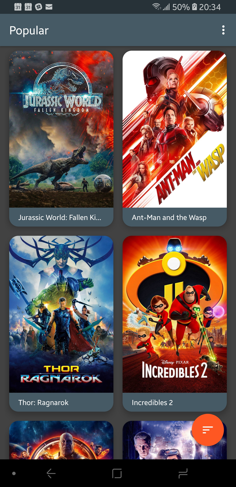
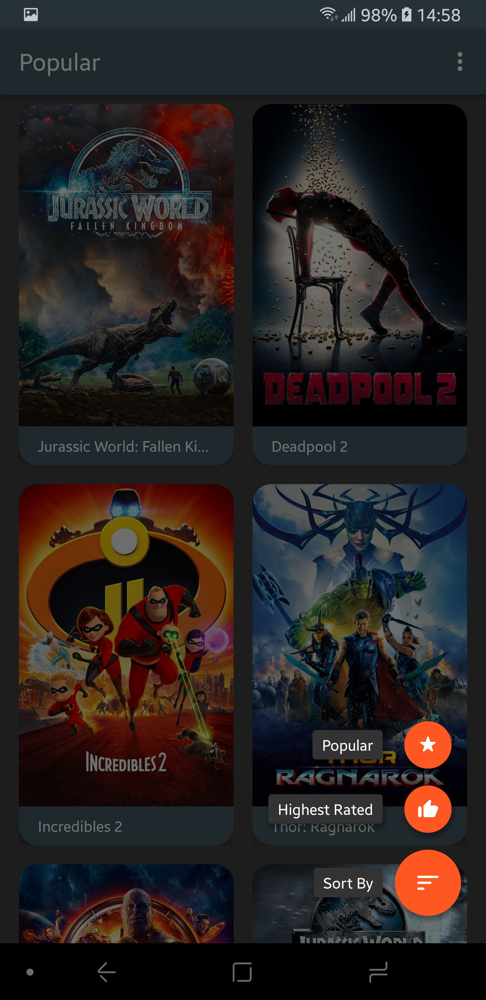

# PopularMovies
Lists information about the most popular and highest rated movies per The Movie Database (https://www.themoviedb.org/).

This is the second and third projects in Udacity's Android Developer Nanodegree.

# Screenshots

  

# Resources

**Icons**

- https://material.io/tools/icons/?style=round

**Libraries**

- Groupie
  - https://github.com/lisawray/groupie
- Floating Action Button
  - https://github.com/Clans/FloatingActionButton
- Toasty
  - https://github.com/GrenderG/Toasty
- Timber
  - https://github.com/JakeWharton/timber
- Retrofit with Gson
- RxJava and RxAndroid
- Glide

# Extra

- The API key hidden in local files.
  - Instructions: https://medium.com/code-better/hiding-api-keys-from-your-android-repository-b23f5598b906
