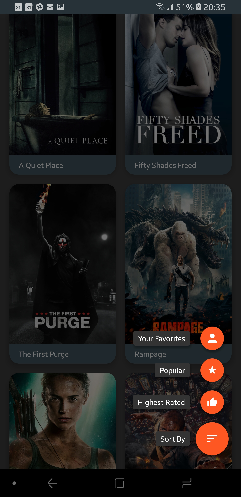

# PopularMovies
Lists information about the most popular and highest rated movies per The Movie Database (https://www.themoviedb.org/).

Created for Udacity's Android Developer Nanodegree.

# Screenshots

  

# Resources

**ICONS**

App's icon

- https://material.io/tools/icons/?icon=local_movies&style=round

FAB

- Sort
  - https://material.io/tools/icons/?icon=sort&style=round
- Star
  - https://material.io/tools/icons/?icon=star_rate&style=round
- Thumbs Up
  - https://material.io/tools/icons/?icon=thumb_up&style=round

Error Outline

- https://material.io/tools/icons/?icon=error_outline&style=round

**LIBRARIES**

- Floating Action Button by Dmytro Tarianyk
  - https://github.com/Clans/FloatingActionButton
- Retrofit
- Gson
- RxAndroid
- RxJava
- Glide
